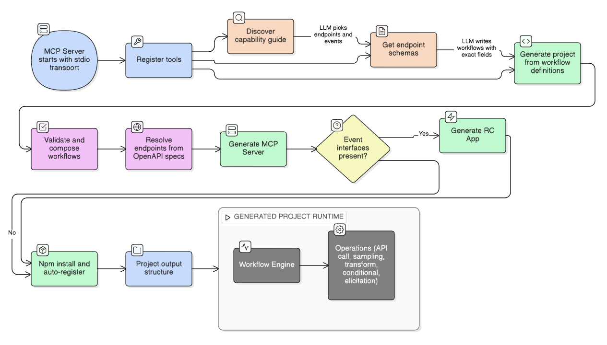

<h1 align="center">Rocket.Chat MCP Server Generator</h1>

<p align="center">
  A <a href="https://github.com/google-gemini/gemini-cli">gemini-cli</a> extension that generates <strong>minimal</strong>, <strong>workflow-driven</strong> MCP servers for Rocket.Chat — solving context bloat while supporting event-driven RC Apps with AI reasoning.
</p>

<p align="center">
  <a href="https://opensource.org/licenses/MIT"></a>
  <a href="https://nodejs.org/"></a>
  <a href="https://www.typescriptlang.org/"></a>
  <a href="https://modelcontextprotocol.io/"></a>
  <a href="https://rocket.chat/"></a>
</p>

---

## The Problem

Today, one major problem when adopting MCP is **context bloat** — almost all MCP servers are written to support a large set of service APIs, and anyone adopting them will have most of their token budget consumed by static MCP requirements associated with API calls they will never need. This situation is exacerbated in agentic code generator workflows where every agent is burning tokens in loops unnecessarily while supporting APIs/tools that the project will never use.

## The Solution

This generator solves context bloat by letting Rocket.Chat developers generate a production-grade minimal MCP server covering **only** the subset of APIs required by their project. Describe what you need in plain English — the generator identifies the relevant APIs and Apps-Engine events, composes multi-step workflows that chain API calls with AI reasoning, and outputs a complete project with tests.

The output is not just a thin REST wrapper — each generated MCP tool is a **workflow** that chains N API calls, LLM sampling, user elicitation, and conditional logic into one atomic operation. When the prompt describes realtime events ("when a message is sent..."), the generator also produces a native **RC App** that bridges into the MCP server.

## Architecture



**Three-Stage Pipeline**: Discovery → Schema Inspection → Generation

## Key Features

### API & Event Discovery

- **Automatic OpenAPI parsing** — Fetches Rocket.Chat's official OpenAPI YAML specs (558 endpoints across 12 domains) from GitHub at runtime using `@apidevtools/swagger-parser`. No manual endpoint definitions needed.
- **Apps-Engine event parsing** — Dynamically discovers all 47 event handler interfaces from `@rocket.chat/apps-engine` using `ts-morph`, extracting method signatures, parameter types, and shapes from the `.d.ts` files.
- **Zero maintenance** — When RC adds or changes endpoints or event interfaces, they're available immediately. No manual updates.
- **Three-tier caching** — Parsed specs are cached in memory for instant reuse, persisted to disk (24h TTL) to survive restarts, and fetched from GitHub only on cache miss.
- **Lazy schema extraction** — Browsing shows only lightweight summaries. The expensive JSON Schema mapping only runs for endpoints you actually select.
- **Parallel domain fetching** — Multiple API domains are fetched and parsed concurrently.

### Workflow Engine

- **Workflow-as-data** — Each generated MCP tool is a multi-step workflow defined as declarative JSON, not imperative code. The runtime engine interprets step definitions at execution time.
- **5 step types** — `api_call` (RC REST API), `sampling` (LLM reasoning via MCP sampling), `elicitation` (human-in-the-loop confirmation), `transform` (data reshaping), `conditional` (branching logic).
- **Dependency graph** — Steps declare `dependsOn` arrays forming a DAG. Steps with shared dependencies can execute in parallel.
- **Persistence** — Cross-invocation state tracking (per-user, per-room, or custom key) via RC Apps-Engine `IPersistence`.
- **Workflow composer** — Validates LLM-generated workflow definitions: checks step references, detects cycles, computes topological order, auto-adds missing `dependsOn`, and warns about common mistakes (hardcoded room IDs, static sampling prompts, orphaned steps).

### RC App Generation

- **Bridged architecture** — When event interfaces are provided, the generator produces both an MCP server (AI reasoning) and an RC App (event handling), linked via an HTTP bridge. The RC App catches events and delegates to the MCP server for workflow execution.
- **Dynamic event wiring** — Event handler code is generated from `ts-morph`-parsed interface signatures. Supports all 47 Apps-Engine events including pre-event handlers (`IPreMessageSentPrevent`, `IPreRoomCreatePrevent`).
- **Slash commands & webhooks** — Generated RC Apps can include slash commands and webhook endpoints alongside event handlers.
- **Native RC App structure** — Output matches the official `rc-apps` CLI structure: `app.json`, typed handlers, settings, helpers, `.rcappsconfig`.

### Code Generation

- **Multi-file output with tests** — Each generated server is a complete project: one file per workflow tool, a shared HTTP client, per-tool test files, a workflow engine module, a README, and config files.
- **Input validation at generate time** — Validates `inputMapping` field names against actual OpenAPI schemas, checks required fields, and fuzzy-corrects operationId typos before generating code.
- **Expression security** — Transform and conditional expressions are validated at generate time, rejecting patterns like `require()`, `import()`, `eval()`, `process.exit()`.
- **Auto-registration** — Generated MCP servers are automatically registered in `~/.gemini/settings.json` so they're available as Gemini CLI tools immediately.

## Prerequisites

- [Node.js](https://nodejs.org/) v22+
- [gemini-cli](https://github.com/google-gemini/gemini-cli) installed and configured

## Installation

1. **Clone the repository:**

   ```bash
   git clone https://github.com/sezallagwal/mcpGenerator
   cd mcpGenerator
   ```

2. **Install dependencies:**

   ```bash
   npm install
   ```

3. **Register as a gemini-cli extension:**

   ```bash
   mkdir -p ~/.gemini/extensions
   ln -s "$(pwd)" ~/.gemini/extensions/mcpGenerator
   ```

   This symlinks the project into gemini-cli's extensions directory so it's loaded automatically.

## Usage

Launch `gemini` in any project directory. The extension provides three MCP tools that Gemini uses automatically based on your natural language requests:

| Tool                       | Purpose                                                                | When to Call             |
| -------------------------- | ---------------------------------------------------------------------- | ------------------------ |
| **`get_capability_guide`** | Returns all 558 API endpoints and 47 Apps-Engine events                | First — discovery        |
| **`get_endpoint_schemas`** | Returns exact JSON schemas for chosen operationIds and eventInterfaces | Second — inspect schemas |
| **`generate`**             | Validates workflows, composes the project, writes all files            | Last — generate          |

### Quick Start

Just describe what you want in plain English:

```
gemini> I need an MCP server that can send messages and manage channels
```

Gemini will:

1. Call `get_capability_guide` to discover relevant endpoints and events
2. Call `get_endpoint_schemas` to get exact field names for workflow steps
3. Call `generate` with composed workflows — outputs a complete project

### Slash Command

```
gemini> /generator:generate send alerts based on workspace statistics
```

### Example

Here's a real-world prompt that generates a fully working onboarding bot:

> When a new user is created in Rocket.Chat, automatically:
>
> 1. Add them to **#general** and **#announcements**, plus role-appropriate channels — if their role includes `admin`, add to **#admin-ops**; if `livechat-agent`, add to **#support-team**; if `moderator`, add to **#mod-team**
> 2. Send them a welcome DM
> 3. Use AI to generate a personalized onboarding checklist based on their assigned roles
> 4. Create a private **onboarding-{username}** channel and invite the user who created them (`performedBy`) as the onboarding buddy
> 5. Post the generated checklist in that channel

From this single prompt, the generator produces:

- An **MCP server** with a multi-step workflow tool (`api_call` → `conditional` → `sampling` → `api_call` chain)
- An **RC App** with an `IPostUserCreated` event handler that triggers the workflow via HTTP bridge
- Full test suite, `.env.example`, README, and auto-registration in gemini settings

### Pipeline

The pipeline is fully automated — Gemini handles endpoint selection, workflow composition, and code generation autonomously:

```
Describe intent → get_capability_guide → get_endpoint_schemas → generate → Ready to deploy
```

1. **Describe your intent** — Say what you want in plain English. Gemini maps your keywords to the right API domains and event interfaces automatically.
2. **Capability guide** — Gemini calls `get_capability_guide` which returns all endpoints grouped by domain and all Apps-Engine event interfaces. Gemini picks the operationIds and eventInterfaces it needs.
3. **Schema lookup** — Gemini calls `get_endpoint_schemas` with chosen operationIds/eventInterfaces to get exact request/response schemas and event param shapes.
4. **Generate** — Gemini calls `generate` once with all workflows. The tool validates step references, checks `inputMapping` field names against schemas, composes the dependency graph, and writes the complete project to disk.

## Step Types Reference

Each workflow consists of steps. Five step types are supported:

| Type              | Purpose                              | Key Fields                                                                      |
| ----------------- | ------------------------------------ | ------------------------------------------------------------------------------- |
| **`api_call`**    | Call a Rocket.Chat REST API endpoint | `operationId`, `inputMapping`, `outputPath`, `forEach`, `as`, `continueOnError` |
| **`sampling`**    | LLM reasoning (Gemini CLI or API)    | `prompt`, `systemPrompt`, `maxTokens`, `responseFormat`                         |
| **`elicitation`** | Human-in-the-loop confirmation       | `message`, `requestedSchema`, `onDecline`                                       |
| **`transform`**   | Data reshaping via JS expression     | `expression` (validated, sandboxed)                                             |
| **`conditional`** | Branching logic                      | `condition`, `thenStep`, `elseStep`                                             |

Steps support template expressions (`{{params.*}}`, `{{steps.*}}`) for dynamic data flow between steps:

```jsonc
{
  "id": "send_welcome",
  "type": "api_call",
  "operationId": "post-api-v1-chat_sendMessage",
  "dependsOn": ["compose_message"],
  "inputMapping": {
    "message": {
      "rid": "{{params.roomId}}",
      "msg": "{{steps.compose_message.result}}",
    },
  },
}
```

## Generated Project Structure

The generator creates a monorepo with an MCP server (always) and optionally an RC App (if realtime events are needed):

```
my-project/
├── mcp-server/
│   ├── src/
│   │   ├── server.ts              # MCP server entry point
│   │   ├── rc-client.ts           # Shared Rocket.Chat HTTP client
│   │   ├── engine/
│   │   │   └── workflow-engine.ts # Runtime workflow execution engine
│   │   ├── tools/
│   │   │   └── *.ts               # One file per workflow tool
│   │   └── tests/
│   │       ├── setup.ts           # Test setup & mock infrastructure
│   │       └── *.test.ts          # Per-tool test files
│   ├── package.json
│   ├── tsconfig.json
│   ├── .env.example
│   └── README.md
└── rc-app/                        # Only if eventInterfaces provided
    ├── app.json                   # RC App manifest
    ├── *App.ts                    # Main app class (event wiring)
    ├── handlers/                  # Event handler files
    ├── commands/                  # Slash command files
    ├── bridge/
    │   └── mcp-bridge.ts         # HTTP bridge to MCP server
    ├── helpers/
    │   └── message.ts            # Message creation helpers
    ├── settings/
    │   └── settings.ts           # Admin-configurable settings
    └── package.json
```

### Using a Generated Server

```bash
cd projects/my-rc-server/mcp-server
npm install
cp .env.example .env
# Edit .env with your Rocket.Chat credentials
```

The generated server uses stdio transport. Add it to your MCP client's configuration:

```json
{
  "mcpServers": {
    "my-rc-server": {
      "command": "npm",
      "args": ["start"],
      "cwd": "/path/to/my-rc-server/mcp-server"
    }
  }
}
```

## Development

### Project Structure

```
mcpGenerator/
├── commands/
│   └── generator/
│       └── generate.toml        # /generator:generate slash command
├── src/
│   ├── server.ts                # MCP server (3 tools)
│   ├── capability-guide.ts      # Capability guide formatter
│   ├── utils.ts                 # Shared utilities
│   ├── mcp-server/
│   │   ├── mcpServerCodegen.ts  # Workflow → TypeScript code generator
│   │   ├── mcpServerTemplates.ts# Shared project scaffolding templates
│   │   ├── workflowComposer.ts  # Workflow validation & composition
│   │   ├── workflow-engine.ts   # Runtime engine (copied into generated projects)
│   │   ├── types.ts             # Workflow type definitions
│   │   ├── ensureChannelInjector.ts # Channel name normalization
│   │   └── parser/
│   │       ├── index.ts         # OpenAPI parser (fetch, cache, list, extract)
│   │       ├── schema-mapper.ts # OpenAPI → JSON Schema 7 conversion
│   │       └── types.ts         # Parser type definitions
│   ├── rc-app/
│   │   ├── rcAppGenerator.ts    # RC App project orchestrator
│   │   ├── rcAppTemplates.ts    # RC App code templates
│   │   ├── parser.ts            # Apps-Engine capability parser (ts-morph)
│   │   └── types.ts             # RC App type definitions
│   └── tests/
│       ├── parser.test.ts           # 47 tests — OpenAPI parsing & schema mapping
│       ├── generate.test.ts         # 56 tests — Code generation & validation
│       ├── workflow.test.ts         # 100 tests — Workflow composition & validation
│       ├── workflow-engine.test.ts  # 76 tests — Runtime engine execution
│       ├── rc-app.test.ts           # 104 tests — RC App code generation
│       ├── rc-app-parser.test.ts    # 30 tests — Apps-Engine interface parsing
│       └── capability-guide.test.ts # 30 tests — Guide formatting
├── package.json
├── tsconfig.json
└── gemini-extension.json        # Extension manifest
```

### Running Tests

```bash
npm test
```

### Building

```bash
npm run build
```

### Running in Dev Mode

```bash
npm run dev
```

## License

[MIT](LICENSE)
